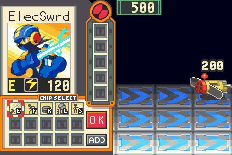
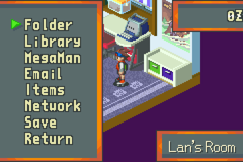

# Mega Man Battle Network – Quality of Life Patches

Two small fixes for Mega Man Battle Network 1 (GBA), borrowed from what the later games do.

| Chip codes on the Custom Screen | Area names in the pause menu |
|---|---|
|  |  |

- **Chip codes on the Custom Screen.** Every chip shows its code letter in the corner of its icon, so you no longer have to move the cursor over each chip. Works on every row after ADD, and the letter greys out with the chip when it can't be picked.
- **Area names in the pause menu.** A box at the bottom-right shows where you are, like BN2 ("Internet 3", "Undernet 7", "WWW Comp 2", "Lan's Room", …). It slides in with the Zenny box and uses the game's own font. Covers the whole Net, every comp and homepage, and the real-world rooms.

## Download

Get **`bn1_qol_v1.0.zip`** from the [latest release](../../releases/latest), or grab a single patch from [`patches/`](patches/).

| Patch | What it does |
|---|---|
| `bn1_qol_us` / `bn1_qol_eu` | both fixes (use this one) |
| `bn1_chipcodes_us` / `bn1_chipcodes_eu` | chip codes only |
| `bn1_arealabels_us` / `bn1_arealabels_eu` | area names only |

Apply **one** patch. `_us` is for the American ROM, `_eu` for the European one.

## Required ROM

| Patch | ROM | Game code | CRC32 | SHA-1 |
|---|---|---|---|---|
| `_us` | Mega Man Battle Network (USA) | AREE, rev 0 | `1D347971` | `a4fbae389654a6611d0597b1e9109cbbd32a132f` |
| `_eu` | Mega Man Battle Network (Europe) | AREP, rev 0 | `1A7FB4FA` | `b017b6054ffafc012be9adee785819b17706cabc` |

The Legacy Collection is not supported.

## How to patch

- **`.bps`** (recommended, refuses to patch the wrong ROM): [Rom Patcher JS](https://www.marcrobledo.com/RomPatcher.js/), Floating IPS (Flips), or load it directly in mGBA (File → Load patch).
- **`.ips`** (Lunar IPS and older tools): does **not** check the ROM, so verify the CRC32 above. Applying a `_us` patch to the European ROM, or the other way round, will break the game.

Patch a copy of your ROM. Existing save files keep working; the patches change no save data.

## Known limitations

- A few area names are shortened to fit the box (e.g. "Traffic Comp 1" instead of "Traffic Light Comp 1", "Plant Elevator").
- A handful of rarely visited rooms may have no name; the box is simply not shown there.

## Credits

- Area IDs: vgperson's [MMBN Save Editor](https://github.com/vgperson/MMBNSaveEditor)
- Area names: The Rockman EXE Zone wiki
- Text table: Prof. 9's [TextPet](https://github.com/Prof9/TextPet)
- Chip data: StraDaMa's [mmbn-chip-tables](https://github.com/StraDaMa/mmbn-chip-tables)
- Tools: armips (Kingcom), Floating IPS (Alcaro), mGBA (endrift), Ghidra

Mega Man Battle Network is © Capcom. This project distributes patches only, no game data.
